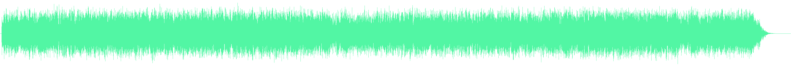

# draw-wave

[](https://npmjs.org/package/draw-wave)

## Usage

``` javascript
var drawBuffer = require('draw-wave');

drawBuffer(document.querySelector('.my-canvas'), audiobuffer, '#52F6A4');
```
This will look produce something like this

(here is the song https://www.youtube.com/watch?v=PJfFv0J42NM)

[og version](https://github.com/cwilso/Audio-Buffer-Draw)
